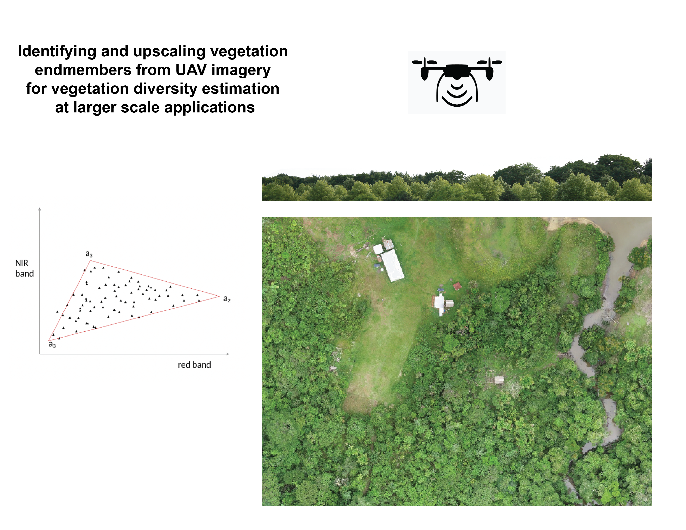

# Software Development Final Project
Final project for the course Software Development @[PLUS](https://www.plus.ac.at/)

# Identifying and upscaling vegetation endmembers from UAV imagery to estimate vegetation diversity at larger scale applications
Henrike Dierkes, Edgar Manrique, Kiarash Pooladsaz

## Aim
- Identify the proportion of different vegetation species within a pixel by upscaling UAV derived vegetation endmembers, using Linear Spectral Mixture Analysis (LSMA)
    - Automatically extract endmember spectra from UAV images using stratified random sampling and an unsupervised clustering algorithm to differentiate vegetation endmembers.
    - Apply LSMA to estimate vegetation diversity.
    - Make an interactive web application using streamlit.io to visualize the results and modify some parameters interactively.

## Expected Outcomes
- Combine UAV and Satellite imagery for LSMA.
    - Algorithms to identify endmembers in UAV imagery.
    - Algorithms to upscale UAV derived endmembers to coarser resolution satellite imagery.
- Standardized workflow for LSMA.
- Streamlit application.

## Data
- Sentinel 2 Level 2A cloud free mosaic (10m pixel size). 
- UAV imagery (~2cm pixel size). 

## Responsibilities
- Conceptualization of the idea (Henrike, Edgar, Kiarash).
- Endmembers extraction from UAV imagery (Henrike & Edgar).
- LSMA Analysis (Henrike & Kiarash).
- Web application (Edgar & Kiarash).

## Due date
- 15th July 2022

## Expected time effort
- Kiarash: 30h
- Edgar: 30h
- Henrike: 30h 

# Methodology 
Spectral Mixture Analysis is a widely used methodology in Remote Sensing analysis. When classifying image pixels based on spectral information, the same problem occurs again and again - classifying the so-called mixed pixels. These are caused by the fact that the spatial resolution of the image pixels is in most cases larger than the to-be-classified surface type. Hence, the classification based on the spectral information is sometimes really difficult.
Spectral Mixture Analysis (SMA) tries to overcome this problem by identifying the proportion of different surface types within each single pixel. The basic assumption of unmixing is that pixel represent a combination of multiple disparate surface cover types - the mixed pixels. In areas, where the object size exceeds the size of the pixel, we get so-called pure pixel. 

## LSMA
The Linear Spectral Mixture Analysis assumes that the total radiance recorded from a certain pixel can be expressed as a linear combination of its constituents. Mathematically, the problem can be solved using a simple linear equation with two known quantities and one unknown.
This simple inversion is valid only if there is the same number of equations and unknowns. In reality, however, there are more spectral bands than endmembers, so the simple inversion is not possible. Instead, a least square solution is found using the Moore-Penrose pseudoinverse:

$$x = (A^T A)^-1 * A^T * R + e$$        

**x** = *vector of unknown abundances*, 

**R** = *vector of known reflectance values*, 

**A** = *a matrix with known endmembers* and 

**e** = *error term*. 
